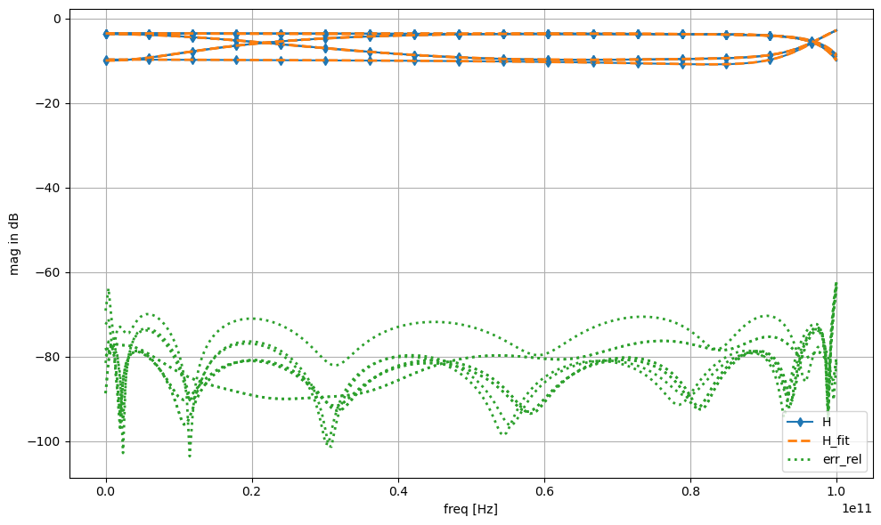

# Vectorfitting

This is a from scratch pure python implementation of the fast relaxed vectorfitting algorithm for MIMO frequency domain data. Different modes (standard VF, relaxed VF and fast relaxed VF) are implemented. Matrix shaped frequency domain data is supported, and a model with common poles is fitted

$$ \mathbf{H}_{fit}(s) = \mathbf{D} + s \cdot \mathbf{E} + \sum_{k=1}^{n} \mathbf{R}_{k} \cdot \frac{1}{s - p_k} $$

where $\mathbf{D}$ is the constant term, $\mathbf{E}$ is the linear term and $\mathbf{R}_{k}$, $p_k$ are the (possibly complex) residues in matrix form and poles. 

## Example


```python
import numpy as np
import matplotlib.pyplot as plt
plt.style.use('dark_background')
cycle = plt.rcParams['axes.prop_cycle'].by_key()['color']

from vectorfitting import VecFit
from parsers import read_touchstone
```


```python
#load data from snp file
Freq, H, *_ = read_touchstone(r"example_data/3port.s3p")
```


```python
#initialize vectorfitting engine
VF = VecFit(H, Freq, n_cpx=5, n_real=1, mode="fast_relax", smart=False, autoreduce=True, fit_Const=True, fit_Diff=False)

#run fitting procedure
VF.fit(tol=1e-5, max_steps=15, debug=True)
```

    debugging status : 
        iteration step number  (step)          : 0
        model order            (n_real, n_cpx) : 1, 5
        fitting relative error (mean, max)     : 0.49136901566282815, 2.657850202535424
    
    debugging status : 
        iteration step number  (step)          : 1
        model order            (n_real, n_cpx) : 3, 4
        fitting relative error (mean, max)     : 0.0005314484496944583, 0.0037071766858198726
    
    n_cpx: 4 -> 3
    n_real: 3 -> 1
    debugging status : 
        iteration step number  (step)          : 2
        model order            (n_real, n_cpx) : 1, 3
        fitting relative error (mean, max)     : 0.0006018634849112722, 0.009863669001006633
    
    debugging status : 
        iteration step number  (step)          : 3
        model order            (n_real, n_cpx) : 1, 3
        fitting relative error (mean, max)     : 0.0006076050098630738, 0.00891959739913526
    
    debugging status : 
        iteration step number  (step)          : 4
        model order            (n_real, n_cpx) : 1, 3
        fitting relative error (mean, max)     : 0.0006076550011962279, 0.008918540946273213
    
    debugging status : 
        iteration step number  (step)          : 5
        model order            (n_real, n_cpx) : 1, 3
        fitting relative error (mean, max)     : 0.0006076321701213752, 0.008918566425843944
    
    debugging status : 
        iteration step number  (step)          : 6
        model order            (n_real, n_cpx) : 1, 3
        fitting relative error (mean, max)     : 0.0006076146740866635, 0.008918478457277485
    
    debugging status : 
        iteration step number  (step)          : 7
        model order            (n_real, n_cpx) : 1, 3
        fitting relative error (mean, max)     : 0.0006075996265262533, 0.008918338497520125
    
    debugging status : 
        iteration step number  (step)          : 8
        model order            (n_real, n_cpx) : 1, 3
        fitting relative error (mean, max)     : 0.0006075856683255433, 0.008918175406856925
    
    debugging status : 
        iteration step number  (step)          : 9
        model order            (n_real, n_cpx) : 1, 3
        fitting relative error (mean, max)     : 0.0006075721968997722, 0.008918002032898739
    
    debugging status : 
        iteration step number  (step)          : 10
        model order            (n_real, n_cpx) : 1, 3
        fitting relative error (mean, max)     : 0.000607558944599357, 0.00891782409279443
    
    debugging status : 
        iteration step number  (step)          : 11
        model order            (n_real, n_cpx) : 1, 3
        fitting relative error (mean, max)     : 0.0006075457924386948, 0.008917644130316479
    
    debugging status : 
        iteration step number  (step)          : 12
        model order            (n_real, n_cpx) : 1, 3
        fitting relative error (mean, max)     : 0.0006075326875050087, 0.008917463277103225
    
    debugging status : 
        iteration step number  (step)          : 13
        model order            (n_real, n_cpx) : 1, 3
        fitting relative error (mean, max)     : 0.0006075196062665287, 0.008917282036525207
    
    debugging status : 
        iteration step number  (step)          : 14
        model order            (n_real, n_cpx) : 1, 3
        fitting relative error (mean, max)     : 0.0006075065382574725, 0.008917100632443484
    
    debugging status : 
        iteration step number  (step)          : 15
        model order            (n_real, n_cpx) : 1, 3
        fitting relative error (mean, max)     : 0.0006074934788237583, 0.008916919164409773
    
    


```python
#evaluate fit
H_fit = VF.TF.evaluate(Freq)

#compute relative error
err_rel = (H - H_fit) / H

#dB helper
dB  = lambda x: 20*np.log10(abs(x))

#plot results
fig, ax = plt.subplots(nrows=1, ncols=1, figsize=(10,6), tight_layout=True, dpi=150)

N, n, m = H.shape

for i in range(n):
    for j in range(m):
        ax.plot(Freq, dB(H[:,i,j]), "-d",  color=cycle[0], markevery=15, markersize=5, label="H" if i==j==0 else None)
        ax.plot(Freq, dB(H_fit[:,i,j]), "--", color=cycle[1], lw=2, label="H_fit" if i==j==0 else None)
        ax.plot(Freq, dB(err_rel[:,i,j]), ":", color=cycle[2], lw=2, label="err_rel" if i==j==0 else None)
        

ax.set_xlabel("freq [Hz]")
ax.set_ylabel("mag in dB")
ax.grid(True)
ax.legend(loc="lower right")

plt.savefig("test.svg")
```


    

    


## References

[1] Gustavsen, B. and Adam Semlyen. “Rational approximation of frequency domain responses by vector fitting.” IEEE Transactions on Power Delivery 14 (1999): 1052-1061.

[2] B. Gustavsen, "Improving the pole relocating properties of vector fitting," in IEEE Transactions on Power Delivery, vol. 21, no. 3, pp. 1587-1592, July 2006, doi: 10.1109/TPWRD.2005.860281.

[3] D. Deschrijver, M. Mrozowski, T. Dhaene and D. De Zutter, "Macromodeling of Multiport Systems Using a Fast Implementation of the Vector Fitting Method," in IEEE Microwave and Wireless Components Letters, vol. 18, no. 6, pp. 383-385, June 2008, doi: 10.1109/LMWC.2008.922585.


