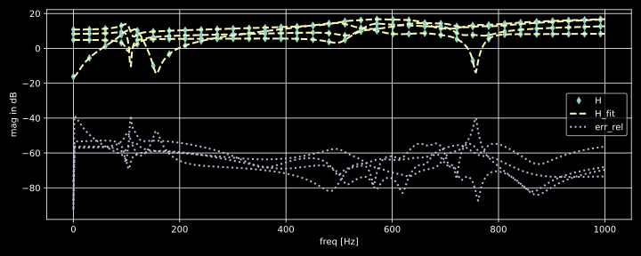

# Vectorfitting

This is a from scratch pure python implementation of the fast relaxed vectorfitting algorithm for MIMO frequency domain data. Different modes (standard VF, relaxed VF and fast relaxed VF) are implemented. Matrix shaped frequency domain data is supported, and a model with common poles is fitted

$$ \mathbf{H}_{fit}(s) = \mathbf{D} + s \cdot \mathbf{E} + \sum_{k=1}^{n} \mathbf{R}_{k} \cdot \frac{1}{s - p_k} $$

where $\mathbf{D}$ is the constant term, $\mathbf{E}$ is the linear term and $\mathbf{R}_{k}$, $p_k$ are the (possibly complex) residues in matrix form and poles. 

## Example


```python
import numpy as np
import matplotlib.pyplot as plt
plt.style.use('dark_background')

from vectorfitting import VecFit
from transferfunction import H_rng
```


```python
#create random test data
Freq = np.linspace(0, 1000, 500)
H    = H_rng(shape=(2, 2), n_cpx=6, n_real=2, f_min=0, f_max=1000).evaluate(Freq)

```


```python
#initialize vectorfitting engine
VF = VecFit(H, Freq, n_cpx=6, n_real=2, mode="fast_relax", smart=False, autoreduce=False, fit_Const=True, fit_Diff=True)

#run fitting procedure
VF.fit(tol=1e-3, max_steps=10, debug=True)
```

    err_max  = 5.99478832051229
    err_mean = 0.36088677540720754
    err_max  = 0.40404156390176854
    err_mean = 0.033194212309662144
    err_max  = 0.19764531624261317
    err_mean = 0.01341915830720979
    err_max  = 0.02385345473261801
    err_mean = 0.0012276647905298632
    err_max  = 0.0075248794431454855
    err_mean = 0.000394116291616274
    err_max  = 0.003225687083334311
    err_mean = 0.0001897611772642082
    err_max  = 0.0015309604356613868
    err_mean = 0.00012391426301653643
    err_max  = 0.001250438060921532
    err_mean = 0.00010080969223796902
    err_max  = 0.0011732043215585063
    err_mean = 9.188134705385897e-05
    err_max  = 0.0011420876671616154
    err_mean = 8.82340928239582e-05
    err_max  = 0.0011290994931467144
    err_mean = 8.670231950199696e-05
    n_real = 2
    n_cpx  = 6
    


```python
#evaluate fit
H_fit = VF.TF.evaluate(Freq)

#compute relative error
err_rel = (H - H_fit) / H

#dB helper
dB  = lambda x: 20*np.log10(abs(x))

#plot results
fig, ax = plt.subplots(nrows=1, ncols=1, figsize=(8,4), tight_layout=True, dpi=120)

N, n, m = H.shape

for i in range(n):
    for j in range(m):
        ax.plot(Freq, dB(H[:,i,j]), ".-", markevery=10, color="tab:red", label="H" if i==j==0 else None)
        ax.plot(Freq, dB(H_fit[:,i,j]), "--", color="tab:blue", label="H_fit" if i==j==0 else None)
        ax.plot(Freq, dB(err_rel[:,i,j]), ":", color="tab:green", label="err_rel" if i==j==0 else None)
        

ax.set_xlabel("freq [Hz]")
ax.set_ylabel("mag in dB")
ax.grid(True)
ax.legend()

plt.savefig("test.svg")
```


    

    


## References

[1] Gustavsen, B. and Adam Semlyen. “Rational approximation of frequency domain responses by vector fitting.” IEEE Transactions on Power Delivery 14 (1999): 1052-1061.

[2] B. Gustavsen, "Improving the pole relocating properties of vector fitting," in IEEE Transactions on Power Delivery, vol. 21, no. 3, pp. 1587-1592, July 2006, doi: 10.1109/TPWRD.2005.860281.

[3] D. Deschrijver, M. Mrozowski, T. Dhaene and D. De Zutter, "Macromodeling of Multiport Systems Using a Fast Implementation of the Vector Fitting Method," in IEEE Microwave and Wireless Components Letters, vol. 18, no. 6, pp. 383-385, June 2008, doi: 10.1109/LMWC.2008.922585.


