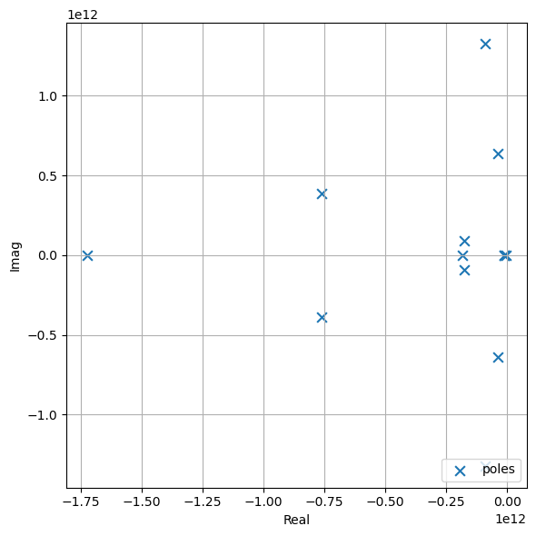

# Vectorfitting

This is a from scratch pure python implementation of the fast relaxed vectorfitting algorithm for MIMO frequency domain data. Different modes (standard VF, relaxed VF and fast relaxed VF) are implemented. Matrix shaped frequency domain data is supported, and a model with common poles is fitted

$$\mathbf{H}_{fit}(s) = \mathbf{D} + s \cdot \mathbf{E} + \sum_{k=1}^{n} \mathbf{R}_{k} \cdot \frac{1}{s - p_k} $$

where $\mathbf{D}$ is the constant term, $\mathbf{E}$ is the linear term and $\mathbf{R}_{k}$, $p_k$ are the (possibly complex) residues in matrix form and poles. 

## Example


```python
import numpy as np
import matplotlib.pyplot as plt
# plt.style.use('dark_background')
cycle = plt.rcParams['axes.prop_cycle'].by_key()['color']

from vectorfitting import VecFit, RelaxedVecFit, FastRelaxedVecFit
from vectorfitting.parsers import read_touchstone
```


```python
#load data from snp file
Freq, H, *_ = read_touchstone(r"example_data/3port.s3p")

#initialize vectorfitting engine

```


```python
#or initialize vectorfitting engine directly from touchstone file
VF, H, Freq = FastRelaxedVecFit.from_touchstone(
    filepath=r"example_data/3port.s3p",
    n_cpx=6,
    n_real=1,
    smart=False,
    autoreduce=False
)


#run fitting procedure
VF.fit(tol=2e-3, max_steps=15, debug=True)
```

    debugging status : 
        iteration step number  (step)          : 0
        model order            (n_real, n_cpx) : 7, 3
        fitting relative error (mean, max)     : 0.0001708429691544018, 0.0023363418460802367
    
    debugging status : 
        iteration step number  (step)          : 1
        model order            (n_real, n_cpx) : 3, 5
        fitting relative error (mean, max)     : 9.409935882693254e-05, 0.0008016668878070043
    
    


    <vectorfitting.transferfunction.TransferFunction at 0x229ef6a8140>


```python
#evaluate fit in the frequency domain
H_fit = VF.TF.evaluate(Freq)

#compute relative error
err_rel = (H - H_fit) / H

#dB helper
dB  = lambda x: 20*np.log10(abs(x))

#plot results
fig, ax = plt.subplots(nrows=1, ncols=1, figsize=(10,6), tight_layout=True, dpi=100)

N, n, m = H.shape

for i in range(n):
    for j in range(m):
        ax.plot(Freq, dB(H[:,i,j]), "-d",  color=cycle[0], markevery=15, markersize=5, label="H" if i==j==0 else None)
        ax.plot(Freq, dB(H_fit[:,i,j]), "--", color=cycle[1], lw=2, label="H_fit" if i==j==0 else None)
        ax.plot(Freq, dB(err_rel[:,i,j]), ":", color=cycle[2], lw=2, label="err_rel" if i==j==0 else None)
        

ax.set_xlabel("freq [Hz]")
ax.set_ylabel("mag in dB")
ax.grid(True)
ax.legend(loc="lower right")

fig.savefig("Figures/test_freq.png", dpi=300)
```


    

    


```python
#evaluate location of poles
poles = VF.TF.Poles

print("poles :", poles)

#plot results
fig, ax = plt.subplots(nrows=1, ncols=1, figsize=(6,6), tight_layout=True, dpi=100)

ax.scatter(poles.real, poles.imag, marker="x", s=60, color=cycle[0], label="poles")

ax.set_xlabel("Real")
ax.set_ylabel("Imag")
ax.grid(True)
ax.legend(loc="lower right")

fig.savefig("Figures/test_poles.png", dpi=300)
```

    poles : [-1.72203113e+12+0.00000000e+00j -1.83467749e+11+0.00000000e+00j
     -5.17583220e+09+0.00000000e+00j -9.25175278e+10+1.32482288e+12j
     -9.25175278e+10-1.32482288e+12j -7.61051335e+11+3.86841214e+11j
     -7.61051335e+11-3.86841214e+11j -3.68806617e+10+6.37226049e+11j
     -3.68806617e+10-6.37226049e+11j -1.75281196e+11+9.13374927e+10j
     -1.75281196e+11-9.13374927e+10j -1.13430812e+10+7.73637981e+08j
     -1.13430812e+10-7.73637981e+08j]
    


    

    


## References

[1] Gustavsen, B. and Adam Semlyen. “Rational approximation of frequency domain responses by vector fitting.” IEEE Transactions on Power Delivery 14 (1999): 1052-1061.

[2] B. Gustavsen, "Improving the pole relocating properties of vector fitting," in IEEE Transactions on Power Delivery, vol. 21, no. 3, pp. 1587-1592, July 2006, doi: 10.1109/TPWRD.2005.860281.

[3] D. Deschrijver, M. Mrozowski, T. Dhaene and D. De Zutter, "Macromodeling of Multiport Systems Using a Fast Implementation of the Vector Fitting Method," in IEEE Microwave and Wireless Components Letters, vol. 18, no. 6, pp. 383-385, June 2008, doi: 10.1109/LMWC.2008.922585.


```python
!jupyter nbconvert --ClearMetadataPreprocessor.enabled=True --ClearOutput.enabled=True --to markdown README.ipynb
```

    [NbConvertApp] Converting notebook README.ipynb to markdown
    [NbConvertApp] Support files will be in README_files\
    [NbConvertApp] Making directory README_files
    [NbConvertApp] Writing 4401 bytes to README.md
    


```python

```
