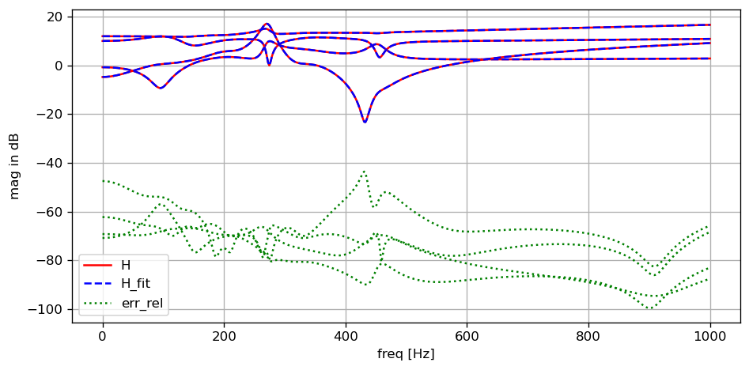

# Vectorfitting

This is a from scratch pure python implementation of the fast relaxed vectorfitting algorithm for MIMO frequency domain data. Different modes (standard VF, relaxed VF and fast relaxed VF) are implemented. Matrix shaped frequency domain data is supported, and a model with common poles is fitted

$$ \mathbf{H}_{fit}(s) = \mathbf{D} + s \cdot \mathbf{E} + \sum_{k=1}^{n} \mathbf{R}_{k} \cdot \frac{1}{s - p_k} $$

where $\mathbf{D}$ is the constant term, $\mathbf{E}$ is the linear term and $\mathbf{R}_{k}$, $p_k$ are the (possibly complex) residues in matrix form and poles. 

## Example


```python
import numpy as np
import matplotlib.pyplot as plt

from vectorfitting import VecFit
from transferfunction import H_rng
```


```python
#create random test data
Freq = np.linspace(0, 1000, 500)
H    = H_rng(shape=(2, 2), n_cpx=6, n_real=2, f_min=0, f_max=1000).evaluate(Freq)

```


```python
#initialize vectorfitting engine
VF = VecFit(H, Freq, n_cpx=6, n_real=2, mode="fast_relax", smart=False, autoreduce=False, fit_Const=True, fit_Diff=True)

#run fitting procedure
VF.fit(tol=1e-3, max_steps=10, debug=True)
```

    err_max  = 12.759986455682323
    err_mean = 0.45924300619473796
    err_max  = 0.5638168681141906
    err_mean = 0.023082375097169424
    err_max  = 0.01648028275113294
    err_mean = 0.0012823360846710864
    err_max  = 0.004482795444363178
    err_mean = 0.0003645481069416049
    err_max  = 0.006564979570699031
    err_mean = 0.0003876664636241148
    err_max  = 0.006638968315212133
    err_mean = 0.00038736001491674444
    err_max  = 0.006641591976707876
    err_mean = 0.00038726987182811706
    err_max  = 0.006639420551059769
    err_mean = 0.00038720156165564766
    err_max  = 0.006636819633279539
    err_mean = 0.00038713510556181546
    err_max  = 0.006634179502419058
    err_mean = 0.0003870687941207088
    err_max  = 0.00663153527719787
    err_mean = 0.00038700247443170367
    n_real = 0
    n_cpx  = 7
    


```python
#evaluate fit
H_fit = VF.TF.evaluate(Freq)

#compute relative error
err_rel = (H - H_fit) / H

#dB helper
dB  = lambda x: 20*np.log10(abs(x))

#plot results
fig, ax = plt.subplots(nrows=1, ncols=1, figsize=(8,4), tight_layout=True, dpi=120)

N, n, m = H.shape

for i in range(n):
    for j in range(m):
        ax.plot(Freq, dB(H[:,i,j]), "-", color="red", label="H" if i==j==0 else None)
        ax.plot(Freq, dB(H_fit[:,i,j]), "--", color="blue", label="H_fit" if i==j==0 else None)
        ax.plot(Freq, dB(err_rel[:,i,j]), ":", color="green", label="err_rel" if i==j==0 else None)
        
ax.grid(True)
ax.legend()
ax.set_xlabel("freq [Hz]")
ax.set_ylabel("mag in dB")
```


    Text(0, 0.5, 'mag in dB')


    

    


## References

[1] Gustavsen, B. and Adam Semlyen. “Rational approximation of frequency domain responses by vector fitting.” IEEE Transactions on Power Delivery 14 (1999): 1052-1061.

[2] B. Gustavsen, "Improving the pole relocating properties of vector fitting," in IEEE Transactions on Power Delivery, vol. 21, no. 3, pp. 1587-1592, July 2006, doi: 10.1109/TPWRD.2005.860281.

[3] D. Deschrijver, M. Mrozowski, T. Dhaene and D. De Zutter, "Macromodeling of Multiport Systems Using a Fast Implementation of the Vector Fitting Method," in IEEE Microwave and Wireless Components Letters, vol. 18, no. 6, pp. 383-385, June 2008, doi: 10.1109/LMWC.2008.922585.
